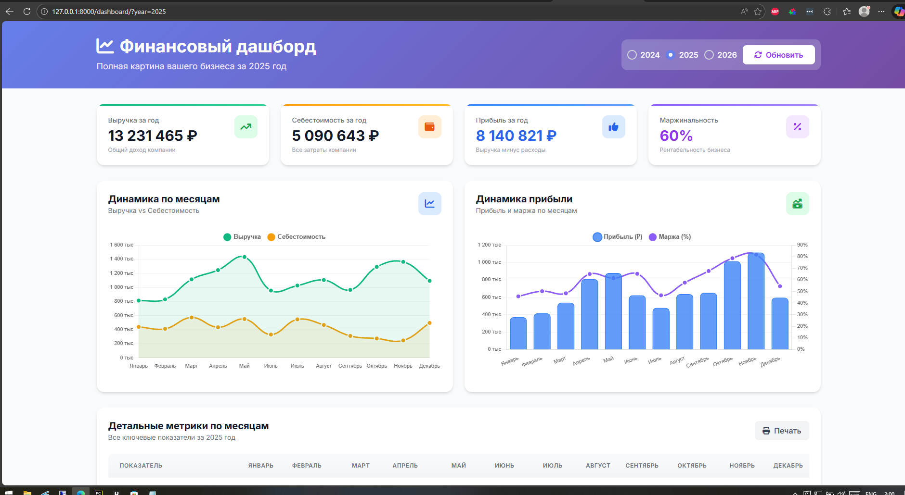
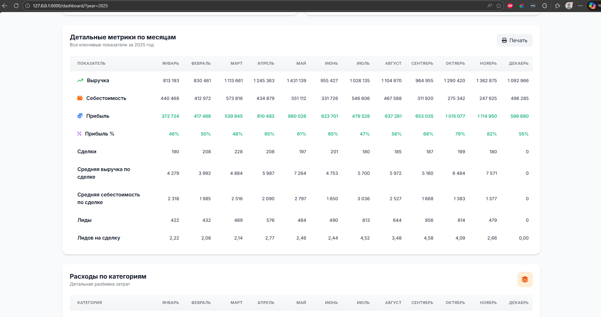
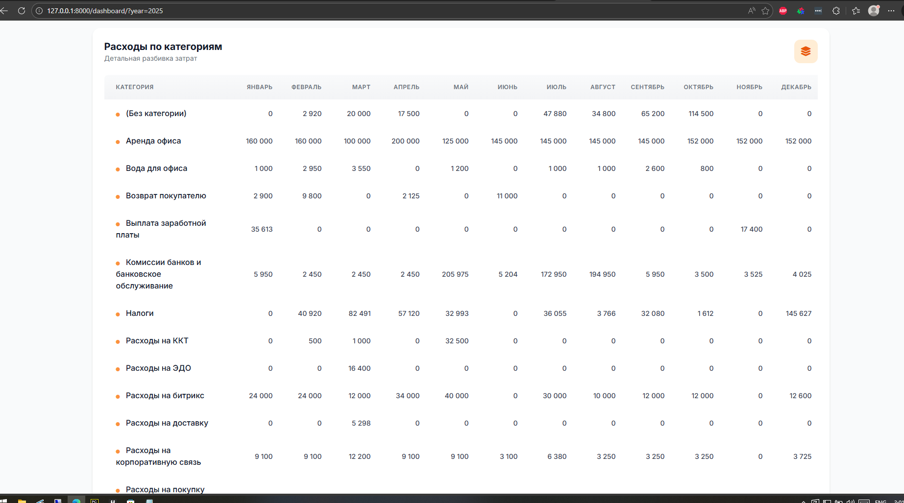
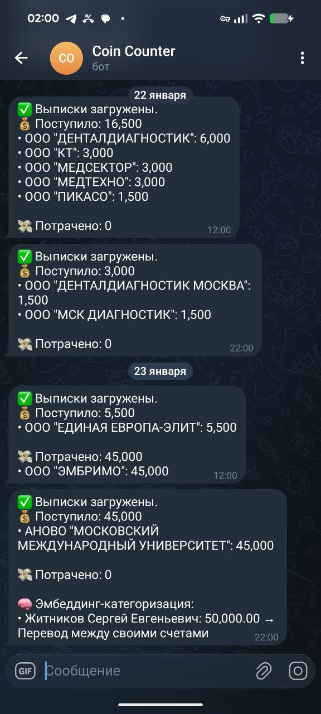
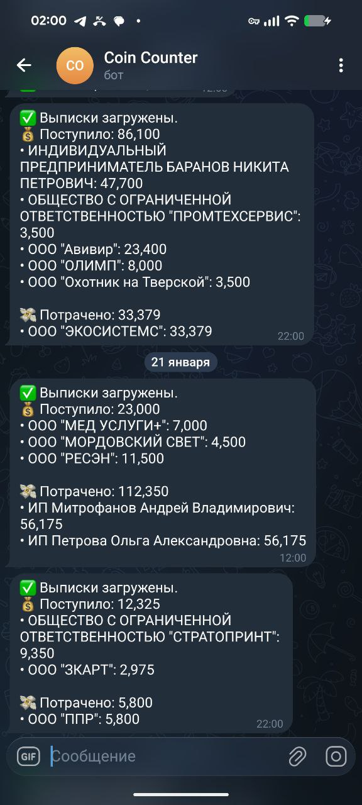
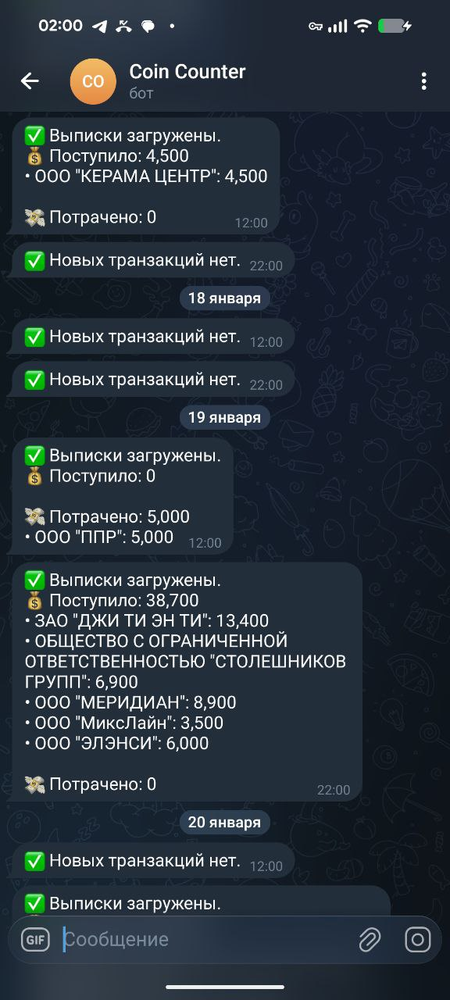
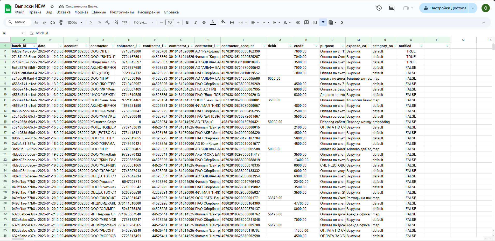
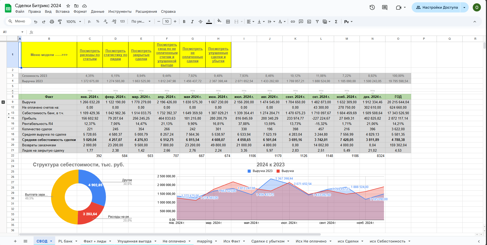
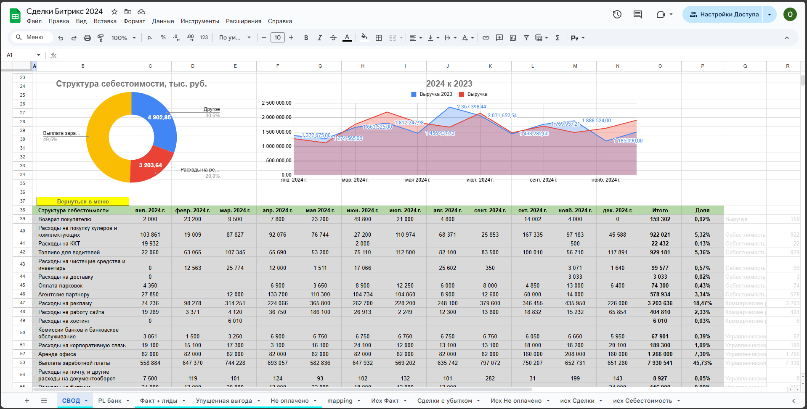

# CoinCounter 📈


### Финансовый ассистент для малого бизнеса и ИП с NLP, автоматизирующий учёт банковских транзакций

**⚡ Работает в production 3+ года** 

## 💡 История проекта

CoinCounter создавался для **небольших ИП и собственников бизнеса**, которые не имеют возможности нанять экономиста или платить дорогие подписки за популярные финансовые сервисы.

**Проблема:** Ручной учёт транзакций отнимает 2-3 часа каждую неделю, а бесплатные решения не дают нужной аналитики.

**Решение:** Полностью автоматизированная система с AI/NLP-категоризацией, работающая на вашем сервере. Все данные под контролем, никаких подписок.

---

## 🎯 Ключевые возможности

- 📊 **Автоматическая категоризация транзакций** (99.6% точность)
  - 🧠 Продвинутый NLP-алгоритм ([подробнее](NLP_ALGORITHM.md))
  - 🔍 Multi-query + Lemmatization + Synonyms + Vector Search
  - 🚀 Три источника: по ИНН, по ключевым словам, через AI embeddings
- 📱 **Telegram-уведомления** в реальном времени
- 📑 **Экспорт в Google Sheets** для совместной работы
- 📈 **Интерактивный Dashboard** с аналитикой и графиками
- 🔗 **Интеграция с Битрикс24** для анализа воронки продаж
- 🎛️ **Django Admin** для удобного управления данными
- 💾 **Доступ к данным:** SQLite + Django Admin (интерфейс для всех операций)

> Работает на реальных данных малого бизнеса 3+ года без проблем

---

## 📚 Оглавление

- [🤖 NLP-алгоритм категоризации](#-nlp-алгоритм-категоризации)
- [📸 Примеры интерфейсов](#-примеры-интерфейсов)
- [⚡ Производительность](#-производительность)
- [🛠 Технологии](#-технологии)
- [📁 Структура проекта](#-структура-проекта)
- [🚀 Установка и запуск](#-установка-и-запуск)
- [⚙️ Настройка категоризации](#-настройка-категоризации)
- [🔑 Получение API-ключей](#-получение-api-ключей-и-токенов)
- [🧭 Roadmap](#-roadmap)
- [📬 Контакты](#-контакты)

---

## 🤖 NLP-алгоритм категоризации

Система использует **продвинутый многоуровневый NLP-алгоритм** для автоматической категоризации транзакций:

### Технологии
1. **Multi-Query:** разбиение сложных назначений платежей на смысловые единицы
2. **Лемматизация (pymorphy2):** приведение слов к начальной форме
3. **Синонимы (RuWordNet):** расширение поиска через семантически близкие слова
4. **Vector Search:** косинусное расстояние между embedding-векторами (OpenAI API)
5. **Smart Boosting:** бонусы за точное совпадение, лемму и синонимы

### Формула итогового скора
```python
final_score = base_embedding_similarity 
              + (0.25 if exact_match else 0)
              + (0.15 if lemma_match else 0)
              + (0.10 if synonym_match else 0)
```

### Точность
- **99.6%** (3021/3033 транзакций на реальных данных)
- Время обработки: 5-15ms на транзакцию (с кэшем)

📖 **Подробное описание алгоритма:** [NLP_ALGORITHM.md](NLP_ALGORITHM.md)

---

## 📸 Примеры интерфейсов

### 📊 Dashboard: Аналитика в реальном времени

<table>
  <tr>
    <td></td>
    <td></td>
  </tr>
  <tr>
    <td colspan="2"></td>
  </tr>
</table>

**Возможности:**
- 📈 Графики выручки и себестоимости по месяцам
- 💰 KPI карточки (выручка, расходы, прибыль, маржинальность)
- 📊 Детальные метрики по месяцам
- 🏷️ Расходы по категориям
- 📅 Фильтрация по годам

---

### 📱 Telegram Bot: Уведомления и быстрый доступ

<table>
  <tr>
    <td></td>
    <td></td>
    <td></td>
  </tr>
</table>

**Возможности:**
- ✅ Итоги загрузки транзакций
- 💵 Выручка по контрагентам
- 📉 Расходы по категориям
- 🤖 Статистика NLP-категоризации
- ⚠️ Неразнесённые транзакции

---

### 🎛️ В каком виде выгружаются данные в google sheets



---

### 📑 Google Sheets: Экспорт и совместная работа

#### Важно: это примеры и в проекте их нет. Но вы всегда можете собрать такие сводные таблички и диаграммы самостоятельно.

<table>
  <tr>
    <td></td>
    <td></td>
  </tr>
</table>

**Возможности:**
- 📊 Автоматический экспорт новых транзакций
- 🔄 Синхронизация с существующими таблицами
- 📈 Базовая аналитика и сводные таблицы (вы настраиваете самостоятельно)
- 👥 Совместный доступ для команды

---

## ⚡ Производительность

**Оптимизация 2026:** Добавлено **10 индексов БД** для быстрых запросов

| Операция | До | После | Улучшение |
|---------|-----|-------|-----------|
| Запросы по году/месяцу | Полное сканирование | Индекс | **10-100x** |
| Запросы по batch_id | Медленно | Индекс | **50-100x** |
| Фильтрация по статусам | Медленно | Индекс | **10-50x** |
| NLP категоризация | 50-150ms | 5-15ms | **10x** (с кэшем) |

---

## 🛠 Технологии

### Backend
- **Django 5.2.3** - основа проекта, ORM, админ-панель
- **Celery + Redis** - асинхронные задачи для обработки транзакций
- **SQLite** - хранилище данных (рекомендуется PostgreSQL для продакшена)

### NLP & AI
- **pymorphy2** - морфологический анализ русского языка
- **RuWordNet** - русская версия WordNet для синонимов
- **OpenAI Embeddings API** - векторное представление текста
- **LRU кэширование** - оптимизация производительности

### Интеграции
- **Telegram Bot API (aiogram)** - уведомления и взаимодействие
- **Google Sheets API (gspread)** - экспорт данных
- **Bitrix24 REST API** - анализ сделок и лидов
- **Tochka Bank API** - автоматическое получение выписок

### Deployment
- **Ubuntu 22.04** - production сервер
- **HTTPS (Let's Encrypt)** - SSL-сертификат
- **tmux** - фоновый запуск сервисов
- **python-dotenv** - управление конфигурацией

---

## 📁 Структура проекта

```
CoinCounter/
├── 📄 README.md                          # Этот файл
├── 📄 NLP_ALGORITHM.md                   # Описание NLP-алгоритма
├── 📄 env.example                        # Шаблон для .env (НАЧНИ ОТСЮДА!)
├── 📄 requirements.txt                   # Зависимости проекта
├── 📄 manage.py                          # Django management
│
├── 📁 coin_counter/                      # Основные настройки Django
│   ├── settings.py                       # Конфигурация + валидация
│   ├── celery.py                         # Настройки Celery
│   ├── urls.py                           # URL-маршруты
│   └── wsgi.py
│
├── 📁 coin_desk/                         # Главное приложение
│   ├── models.py                         # Модели БД (с индексами!)
│   ├── views.py                          # Webhook'и Битрикс24
│   ├── tasks.py                          # Celery-задачи
│   ├── admin.py                          # Админ-панель
│   │
│   ├── 📁 management/commands/           # Django команды
│   │   ├── fetch_bank_data.py           # Получение выписок
│   │   ├── export_transactions_to_sheets.py  # Экспорт в Sheets
│   │   ├── notify_about_new_transactions.py  # Уведомления
│   │   └── run_telegram_bot.py          # Запуск бота
│   │
│   ├── 📁 scripts/                       # Бизнес-логика
│   │   ├── bank_fetch.py                # Работа с банковским API
│   │   └── keywords.py                  # Ключевые слова для категоризации
│   │
│   ├── 📁 telegram_bot/                  # Telegram интеграция
│   │   ├── bot.py                       # Инициализация бота
│   │   ├── handlers.py                  # Обработчики команд
│   │   └── utils.py                     # Утилиты для уведомлений
│   │
│   ├── 📁 utils/                         # NLP утилиты
│   │   ├── nlp_processor.py             # Основной NLP-процессор
│   │   ├── embedding.py                 # AI embeddings
│   │   └── embedding_cache.py           # Кэш embeddings
│   │
│   └── 📁 migrations/                    # Миграции БД
│
├── 📁 dashboard/                         # Dashboard приложение
│   ├── dashboard_transactions.py        # Логика формирования данных
│   ├── views.py                         # Views для дашборда
│   └── 📁 templates/dashboard/          # HTML шаблоны
│
├── 📁 config/                            # Конфигурация
│   └── *.json                           # Google Sheets credentials
│
├── 📁 examples/                          # Скриншоты интерфейсов
│
└── 📁 staticfiles/                       # Статика Django (создаётся автоматически)
```

---

## 🚀 Установка и запуск

### Требования

- **Python 3.11+**
- **Redis** (для Celery)
- **SQLite** (в разработке) или **PostgreSQL** (продакшен)

### Установка (5 минут)

#### 1. Клонируйте репозиторий
```bash
git clone https://github.com/OlgaKalinina101/CoinCounter
cd CoinCounter
```

#### 2. Создайте виртуальное окружение
```bash
python3.11 -m venv venv
source venv/bin/activate  # Linux/Mac
venv\Scripts\activate     # Windows
```

#### 3. Установите зависимости
```bash
pip install -r requirements.txt
```

#### 4. Установите Redis
```bash
# Ubuntu/Debian
sudo apt install redis-server

# macOS
brew install redis

# Windows
# Используйте WSL или Docker
```

#### 5. Настройте .env файл

**ВАЖНО:** Используйте `env.example` как шаблон!

```bash
cp env.example .env
```

Минимальная конфигурация для разработки:

```bash
# Django (обязательно!)
SECRET_KEY=your-secret-key-here-generate-with-python-manage-py-shell
DEBUG=True
ALLOWED_HOSTS=localhost,127.0.0.1
CURRENT_YEAR=2026

# Timezone
TIMEZONE=Europe/Moscow

# Database
SQLITE_PATH=db.sqlite3

# Static files
STATIC_URL=static/
```

> 📖 Как получить остальные ключи, читайте в разделе [Получение API-ключей](#-получение-api-ключей-и-токенов)

#### 6. Примените миграции
```bash
python manage.py migrate
```

#### 7. Соберите статику
```bash
python manage.py collectstatic --noinput
```

#### 8. Создайте суперпользователя
```bash
python manage.py createsuperuser
```

#### 9. Запустите проект

**Вариант 1: Только Django (для начала)**
```bash
python manage.py runserver
```

**Вариант 2: С Celery (полный функционал)**
```bash
# Терминал 1: Django
python manage.py runserver

# Терминал 2: Redis
redis-server

# Терминал 3: Celery Worker
celery -A coin_counter worker -l info

# Терминал 4: Celery Beat (опционально, для расписания)
celery -A coin_counter beat -l info
```

**Вариант 3: С APScheduler (альтернатива Celery Beat)**

Если вы не хотите использовать Celery Beat для расписания задач, можно использовать `automation_scheduler.py` с APScheduler:

```bash
# Терминал 1: Django
python manage.py runserver

# Терминал 2: Automation Scheduler
python automation_scheduler.py
```

**Что делает `automation_scheduler.py`:**
- 📅 Автоматическая загрузка банковских транзакций (два раза в день, или как настроите)
- 📊 Экспорт новых транзакций в Google Sheets (два раза в день, или как настроите)
- 📱 Отправка уведомлений в Telegram (два раза в день, или как настроите)

> 💡 **Преимущества APScheduler:**
> - Не требует Redis
> - Проще в настройке
> - Работает в одном процессе
> - Идеален для небольших проектов

> ⚠️ **Важно:** Используйте либо Celery Beat, либо APScheduler, но не оба одновременно!

#### 10. Откройте в браузере

- **Админка:** http://localhost:8000/admin/
- **Dashboard:** http://localhost:8000/dashboard/

✅ **Готово!**

---

## ⚙️ Настройка категоризации

### Добавление новых категорий расходов

Все категории управляются через **Django Admin**:

1. Откройте http://localhost:8000/admin/
2. Перейдите в **Expense Categories** (Категории расходов)
3. Нажмите **Add Expense Category**
4. Заполните:
   - **Name**: Название категории (например, "Расходы на маркетинг")
   - **PL Entry**: Статья отчета о прибылях и убытках

### Привязка контрагентов к категориям

Вы можете настроить автоматическую категоризацию по ИНН контрагента:

1. Откройте http://localhost:8000/admin/
2. Перейдите в **Contractor Expense Mappings** (Привязка контрагентов)
3. Нажмите **Add Contractor Expense Mapping**
4. Заполните:
   - **Contractor**: Выберите контрагента из списка
   - **Expense Category**: Выберите категорию
   - **Description**: Описание (опционально)

**Пример:** Все транзакции от ООО "Яндекс" (ИНН: 7736207543) автоматически попадут в категорию "Расходы на рекламу".

### Настройка ключевых слов для NLP

Ключевые слова для автоматической категоризации хранятся в файле:

```
coin_desk/scripts/keywords.py
```

**Структура файла:**

```python
CATEGORY_KEYWORDS = {
    "Название категории": [
        "ключевое слово 1",
        "ключевое словосочетание 2",
        "фраза для поиска 3"
    ],
    "Аренда офиса": [
        "за аренду",
        "по договору аренды",
        "арендная плата"
    ],
    "Расходы на рекламу": [
        "рекламные услуги",
        "продвижение в яндекс",
        "контекстная реклама"
    ]
}
```

**Как добавить новые ключевые слова:**

1. Откройте файл `coin_desk/scripts/keywords.py`
2. Найдите нужную категорию или создайте новую
3. Добавьте ключевые слова/фразы в список
4. Сохраните файл
5. Перезапустите Django сервер

**Советы:**
- 💡 Используйте фразы из реальных назначений платежей
- 💡 Добавляйте частичные совпадения (например, "за аренду" вместо "оплата за аренду помещения")
- 💡 NLP алгоритм автоматически учитывает словоформы ("аренда", "аренды", "аренде")
- 💡 Регистр не важен (система приводит всё к нижнему регистру)

**Пример реального назначения платежа:**
```
"Оплата за аренду офисного помещения по договору №123 от 01.01.2025"
```
**Ключевое слово:**
```python
"за аренду"  # ✅ Найдёт совпадение
```

### Приоритет категоризации

Система использует три метода категоризации в следующем порядке:

1. **По ИНН контрагента** (самый приоритетный)
   - Если у контрагента есть маппинг в `Contractor Expense Mappings`
   
2. **По ключевым словам + NLP** 
   - Поиск по `keywords.py` с учетом:
     - Точного совпадения слов
     - Лемматизации (словоформ)
     - Синонимов из RuWordNet
     - Semantic similarity через embeddings

3. **По умолчанию**
   - Если ничего не найдено, категория остается пустой (`None`)

**Проверка категоризации:**

После добавления ключевых слов протестируйте на реальных транзакциях:

```bash
# Загрузите новые транзакции
python manage.py fetch_bank_data

# Проверьте логи
tail -f debug.log | grep "CATEGORY-NLP"
```

В логах вы увидите:
```
[CATEGORY-NLP][batch-uuid] Категория определена: Аренда офиса (score=0.950) [boosts: exact, lemma]
```

---

## 🔑 Получение API-ключей и токенов

### 1. Telegram Bot Token

**Зачем:** Для отправки уведомлений о новых транзакциях

**Как получить:**
1. Откройте Telegram, найдите [@BotFather](https://t.me/BotFather)
2. Отправьте команду `/newbot`
3. Следуйте инструкциям (придумайте имя и username бота)
4. Скопируйте токен вида `123456789:ABCdefGHIjklMNOpqrsTUVwxyz`

**Добавьте в .env:**
```bash
TELEGRAM_BOT_TOKEN=your-telegram-bot-token
```

**Как узнать свой Chat ID:**
1. Откройте https://t.me/userinfobot
2. Отправьте боту `/start`
3. Скопируйте ваш ID (число)

**Добавьте в .env:**
```bash
TELEGRAM_CHAT_IDS=123456789,987654321  # Можно несколько через запятую
```

---

### 2. Google Sheets API

**Зачем:** Для экспорта транзакций в Google Таблицы

**Как получить:**

#### Шаг 1: Создайте проект в Google Cloud
1. Откройте https://console.cloud.google.com/
2. Создайте новый проект (или выберите существующий)
3. Перейдите в **APIs & Services** → **Enable APIs and Services**
4. Найдите и включите **Google Sheets API**
5. Найдите и включите **Google Drive API**

#### Шаг 2: Создайте Service Account
1. Перейдите в **APIs & Services** → **Credentials**
2. Нажмите **Create Credentials** → **Service Account**
3. Заполните форму (имя, описание)
4. Нажмите **Create and Continue**
5. Пропустите опциональные шаги

#### Шаг 3: Создайте ключ
1. Найдите созданный Service Account в списке
2. Нажмите на него → вкладка **Keys**
3. **Add Key** → **Create New Key** → **JSON**
4. Скачайте файл (например, `credentials.json`)

#### Шаг 4: Настройте проект
1. Создайте папку `config` в корне проекта:
   ```bash
   mkdir config
   ```
2. Переместите скачанный JSON в `config/credentials.json`
3. Откройте JSON, найдите поле `client_email` (например, `your-service@project.iam.gserviceaccount.com`)
4. Создайте новую Google Таблицу
5. Нажмите **Share** → добавьте этот email с правами **Editor**
6. Скопируйте ID таблицы из URL:
   ```
   https://docs.google.com/spreadsheets/d/[ВОТ_ЭТОТ_ID]/edit
   ```

**Добавьте в .env:**
```bash
GOOGLE_SHEETS_CREDENTIALS=config/credentials.json
GOOGLE_SHEET_ID=your-google-sheet-id
```

---

### 3. Tochka Bank API 

**Зачем:** Для автоматического получения банковских выписок

**Важно:** Проект работает с **банком Точка**. Если у вас другой банк, адаптируйте `coin_desk/scripts/bank_fetch.py`.

**Как получить:**
1. Откройте личный кабинет банка Точка
2. Перейдите в раздел API или Интеграции
3. Создайте API-ключ или JWT-токен
4. Скопируйте Client ID и токен
5. Найдите номера счетов и БИК банка

**Добавьте в .env:**
```bash
CLIENT_ID=your-bank-client-id
JWT_TOKEN=your-bank-jwt-token
BANK_ACCOUNTS=account1,account2,account3  # Через запятую
BANK_BIC=bank-bic-code
```

---

### 4. Bitrix24 Webhooks (опционально)

**Зачем:** Для интеграции с CRM и анализа сделок/лидов

**Как получить:**
1. Откройте ваш портал Bitrix24
2. Перейдите в **Настройки** → **Настройки портала** → **Вебхуки**
3. Нажмите **Создать вебхук**
4. Выберите нужные права (например, `crm` для сделок и лидов)
5. Скопируйте URL вида `https://your-domain.bitrix24.ru/rest/1/your-token/`
6. Токен - это часть после `/rest/1/`

**Добавьте в .env:**
```bash
WEBHOOK_TOKEN=your-deals-webhook-token
WEBHOOK_TOKEN_2=your-leads-webhook-token
```

---

### 5. OpenAI API

**Зачем:** Для AI-категоризации транзакций через embeddings

**Как получить:**
1. Откройте https://platform.openai.com/ (*требует VPN*).  
2. Зарегистрируйтесь или войдите
3. Перейдите в **API Keys**
4. Нажмите **Create new secret key**
5. Скопируйте ключ (показывается один раз!)

**Добавьте в .env:**
```bash
OPENAI_API_KEY=sk-your-openai-api-key
LLM_API_KEY=sk-your-openai-api-key  # Можно использовать тот же ключ
```

> ⚠️ **Внимание:** Использование OpenAI API платное (~~три копейки, за три года не сьел даже доллар). Проверьте тарифы на https://openai.com/pricing

##### В проекте *сознательно* отсутствует эмбеддинг модель с hugging face, так как целевая аудитория не имеет возможности купить себе хороший ноутбук.  

---

## 💾 Доступ к данным

### SQLite База данных
**Путь:** `db.sqlite3` (в корне проекта)

**Инструменты для просмотра:**
- [DB Browser for SQLite](https://sqlitebrowser.org/) - графический интерфейс
- [SQLite CLI](https://www.sqlite.org/cli.html) - командная строка
- [DBeaver](https://dbeaver.io/) - универсальный клиент БД

**Пример запроса:**
```bash
sqlite3 db.sqlite3
SELECT * FROM coin_desk_transaction ORDER BY date DESC LIMIT 10;
```

### Django Admin
**URL:** http://localhost:8000/admin/

**Возможности:**
- ✏️ CRUD операции для всех моделей
- 🔍 Поиск и фильтрация
- 📊 Экспорт в CSV
- 🎨 Удобный веб-интерфейс

---

## 🌐 Production деплой

### Текущее окружение
- **Сервер:** Ubuntu 22.04
- **HTTPS:** SSL-сертификат через Let's Encrypt
- **Процесс-менеджер:** tmux (3+ года без проблем)
- **База:** SQLite (рекомендуется PostgreSQL для масштабирования)

### tmux сессии
```bash
# Сессия 1: Django
tmux new -s django
python manage.py runserver 0.0.0.0:8000

# Сессия 2: Celery Worker
tmux new -s celery
celery -A coin_counter worker -l info

# Сессия 3: Telegram Bot
tmux new -s telegram
python manage.py run_telegram_bot
```

### Рекомендации для production
- ✅ Использовать **PostgreSQL** вместо SQLite
- ✅ Настроить **systemd** вместо tmux
- ✅ Подключить **Sentry** для мониторинга ошибок
- ✅ Настроить **автоматические бэкапы БД**
- ✅ Использовать **nginx** + **gunicorn** вместо `runserver`
- ✅ Настроить **firewall** и **fail2ban**

---

## 🧭 Roadmap

### В перспективе (архитектурно заложено, реализуется поэтапно)

1. **Улучшение Dashboard**
   - Drill-down: провал в детали любой ячейки таблицы
   - Экспорт графиков в PDF
   - Кастомные фильтры и отчёты

2. **Расширение функционала**
   - Ввод наличных операций (эквайринг)
   - Подотчётные расходы сотрудников
   - Планирование бюджета

3. **ML улучшения**
   - Fine-tuning эмбеддинг-модели на доменных данных
   - Обучение на ручных корректировках
   - Предсказание категорий с учётом истории

4. **Интеграции**
   - Поддержка других банков
   - Интеграция с 1С
   - REST API для внешних систем

---

## 📝 Статистика и качество

### Точность категоризации
- **99.6%** точность (3021/3033 транзакций)
- Проверено на вручную размеченных данных за 3 года
- Три метода: ИНН маппинг, AI embeddings, правила по умолчанию

### Качество кода
- ✅ Модульная архитектура
- ✅ 10 индексов БД для производительности
- ✅ DRY principle (без дублирования)
- ✅ Полное логирование (debug.log)
- ✅ Валидация всех входных данных
- ✅ PEP8 compliance

---

## 📬 Контакты

**Разработчик:** Ольга Калинина

- 💼 **GitHub:** [@OlgaKalinina101](https://github.com/OlgaKalinina101)
- 📧 **Email:** kalinina.olgarbc@gmail.com
- 💬 **Issues:** https://github.com/OlgaKalinina101/CoinCounter/issues

---

## 📄 Лицензия

MIT License - используйте свободно в коммерческих и личных проектах

